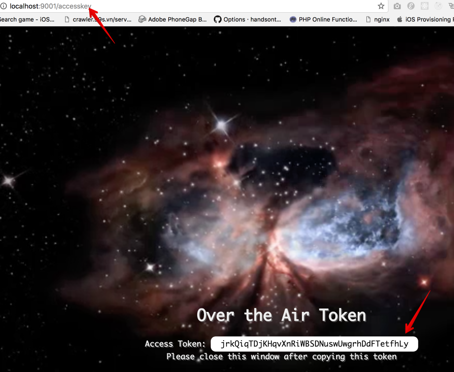

# OTA Server demo

A CodePush Managementc UI.

##Start cassandra from local

```
    curl https://archive.apache.org/dist/cassandra/3.9/apache-cassandra-3.9-bin.tar.gz | tar -xvzf -
    cd cassandra-3.9
    ./bin/cassandra
```

##Installation

```
    # install node_modules
    yarn
    yarn start
```

##Start code-push

```
    npm install code-push-cli -g
    code-push register http://localhost:9001
```

Go to http://localhost:9001/accesskey

